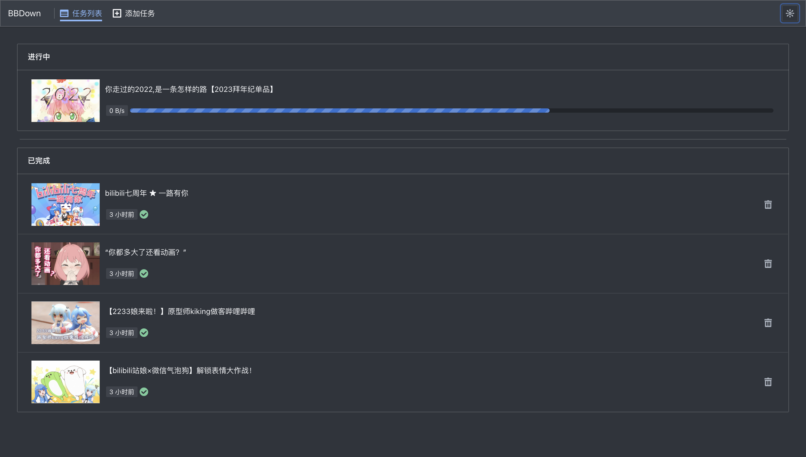
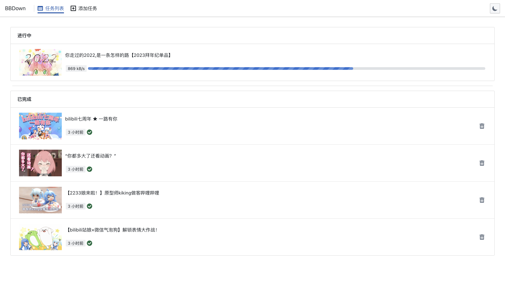
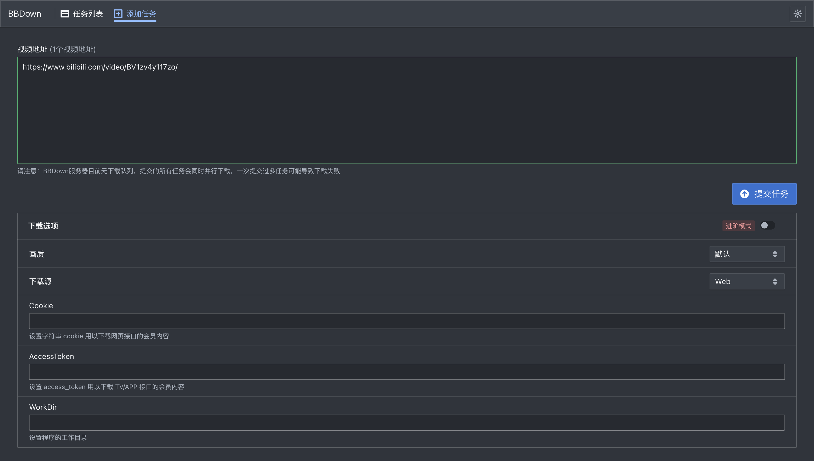
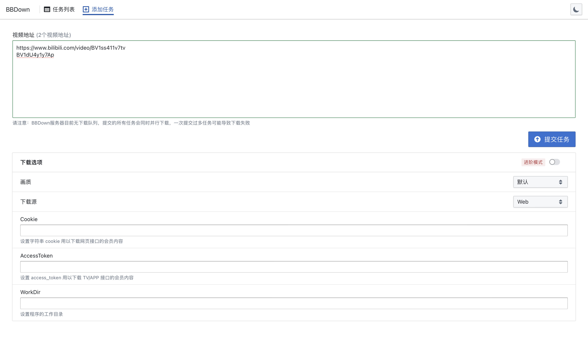
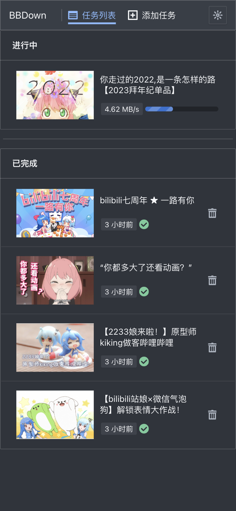
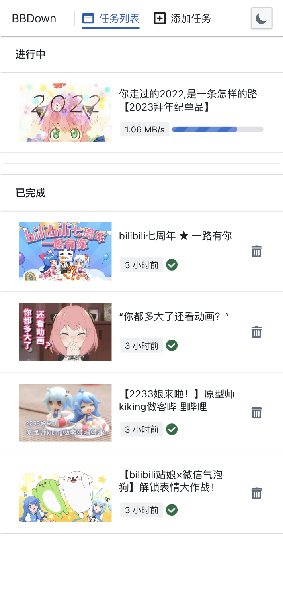
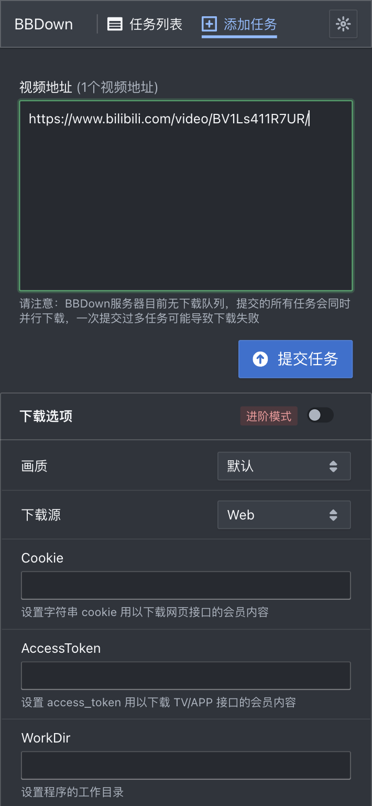
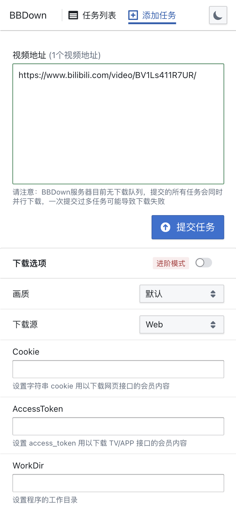

# BBDown WebUI

BBDown WebUI是一个Web前端，适用于[BBDown](https://github.com/nilaoda/BBDown)的[JSON API](https://github.com/nilaoda/BBDown/blob/master/json-api-doc.md)模式。旨在方便将BBDown作为自建服务使用。

## 特性

- 不使用服务端框架，仅需简单的 HTTP 服务器提供静态文件
- 响应式布局设计，兼容计算机和移动设备
- 简洁的界面设计，专注于核心功能
- 可修改的用户配置文件，允许更改BBDown所有命令行选项的默认值

## 截图

### 电脑

| 深色模式 | 浅色模式 |
| --- | --- |
|  |  |
|  |  |

### 手机

| 深色模式 | 浅色模式 |
| --- | --- |
|  |  |
|  |  |


### 使用说明

在[release](./release)页面下载预先打包好的文件并部署到Web服务器上

以下以nginx为例， 编辑你的 nginx 配置文件：

```nginx
server {
    listen 80;
    server_name bbdown.local;

    root /var/www/bbdown-webui;
    index index.html;

    location / {
        try_files $uri $uri/ =404;
    }
}
```

确保将 `root /var/www/bbdown-webui;` 替换为你解压后的文件路径
并将`server_name bbdown.local;`改为你希望的域名和IP

## 构建

1. 克隆或下载本仓库。

    ```bash
    git clone https://github.com/gnattu/bbdown-webui.git
    ```

2. 进入项目目录。

    ```bash
    cd bbdown-webui
    ```

3. 安装依赖。

    ```bash
    npm install
    ```

4. 启动 WebUI。

    ```bash
    npm run dev
    ```

如果你想构建生产版本，可以运行以下命令：

```bash
npm run build
```

打包好的生产版本会在`dist`目录中

## 配置

BBDown WebUI 将尝试从服务器获取配置信息，包括用户配置和 BBDown 工具的配置。在构建生产版本后，会生成一个 `userconfig.json` 文件，用户可以修改该文件来设置 BBDown 的服务器地址和默认下载配置。

`userconfig.json` 文件示例：

```json
{
  "bbdownUrl": "http://127.0.0.1:23333",
  "bbdownMyOptions": {
    "MultiThread": true,
    "ForceHttp": true,
    "SkipAi": true,
    "ForceReplaceHost": true,
    // 其他可用选项请参考 src/datatype.ts 中的 BBDownMyOption 类定义
    // 在Interface IBBDownMyOption中定义的选项是GUI中不会出现的隐藏选项，这些选项依然会被发送到BBDown
  }
}
```

## 局限性

目前版本的BBDown-WebUI存在一些功能上的局限性，主要受BBDown后端的限制，这些问题将在未来更新中改善。以下是当前版本的一些局限性：

### 1. 无法中断和暂停下载中的任务

BBDown暂时没有提供太好的中断和暂停下载任务的方法，在命令行模式下中断下载是直接退出进程，因此BBDown-WebUI无法执行这些操作。在极端情况下如果出现任务卡死，可能需要重新启动服务。

### 2. 多P下载任务缺乏分P进度显示

BBDown后端接口尚未提供多P下载任务的分P进度信息，因此BBDown-WebUI无法展示多P下载任务的详细进度。

### 3. 并行任务过多可能导致失败

由于BBDown后端目前未实现下载队列，所有提交的任务都会并行下载。并行任务较多时可能导致任务失败。

## 许可证

[MIT](LICENSE)
